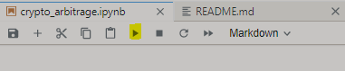
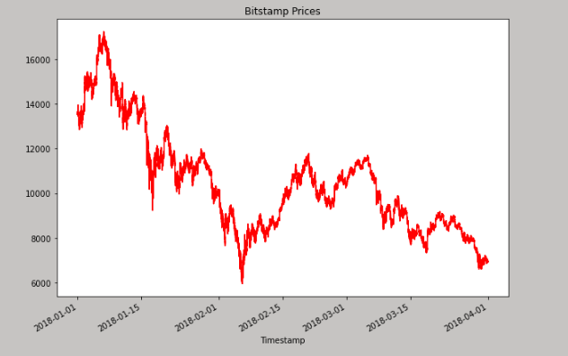
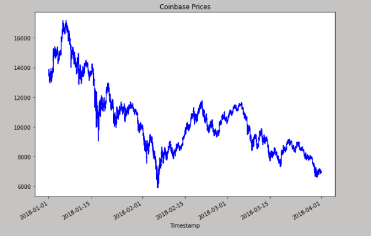
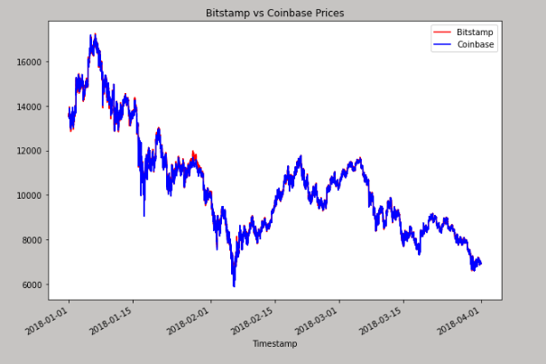

# Module 3 Challenge - Crypto Arbitrage

## Application to sort through historical trade data for Bitcoin on two exchanges: Bitstamp and Coinbase


This is a python command-line interface application that sorts through historical trade data for Bitcoin on two exchanges: Bitstamp and Coinbase. The three phases of financial analysis(data collection, preparation, and analysis) is used to determine if any arbitrage opportunities exist for Bitcoin.

---
## Usage

To use this application, simply clone the repository and open jupyter lab from git bash by running the following command:

```python
jupyter lab
```

Upon launching the application in Jupyter lab notebook, run the file by using the run button on the top of the notepad.



---
## Examples

### Bitstamp gragh for all time



### Coinbase gragh for all time


### Bitstamp vs Coinbase prices gragh for all time

---

## Contributors

Mandetebe Bitema

---


